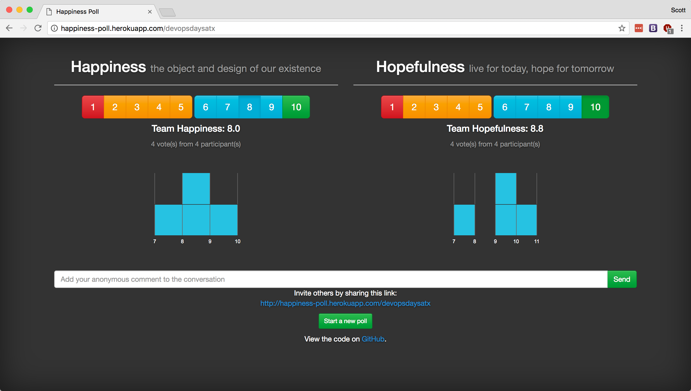
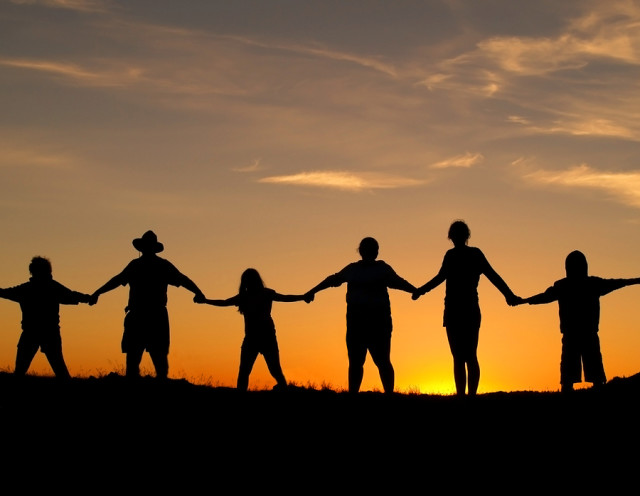
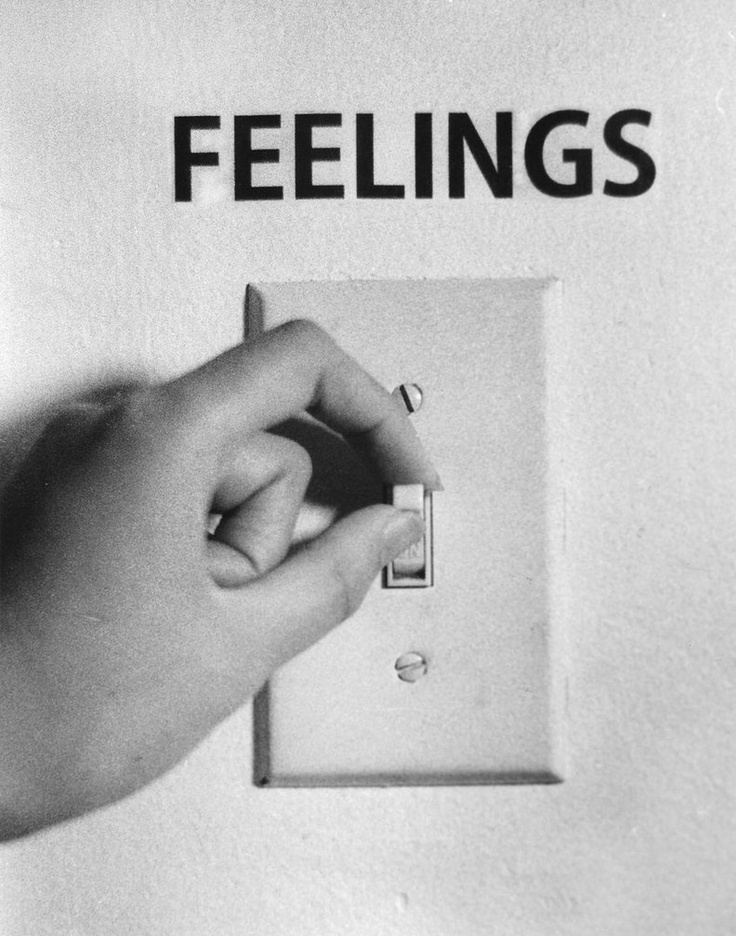
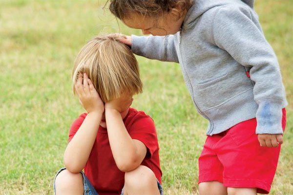
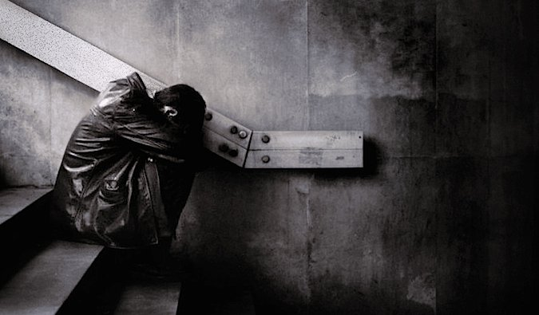
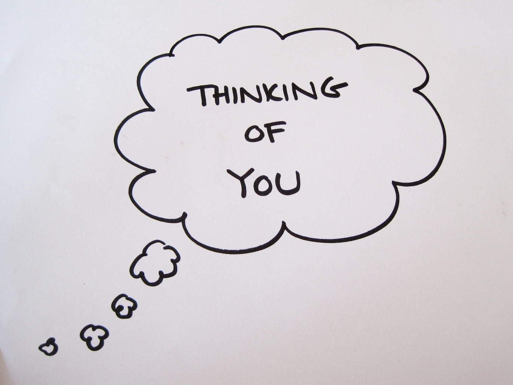
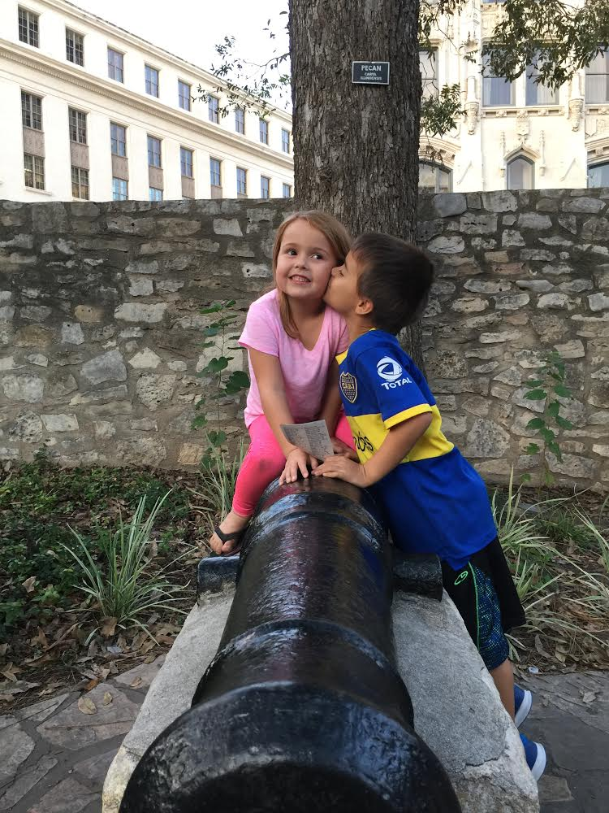
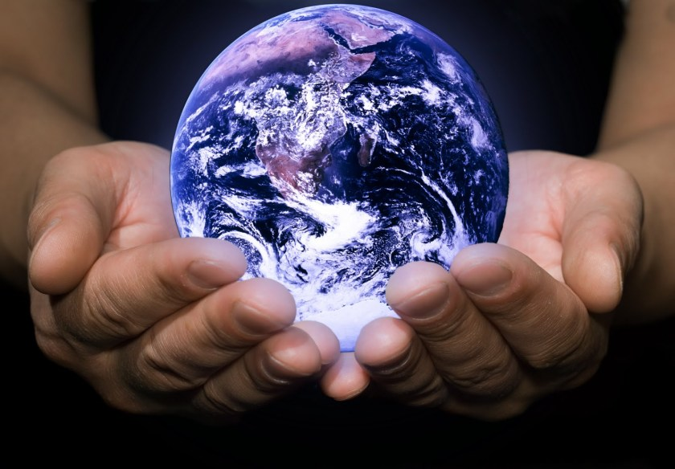

# The EVE Formula to Happiness

> Happiness can be found in the darkest of times,  if only we remember to turn to the light.
-- Dumbledore

### Scott Baldwin  @scottsbaldwin

---

---

$$
\frac{vulnerability * empathy}{ego}
$$

---

# Balance Attitudes Toward

* Self (egolessness)  
* Others (empathy)  
* Connections (vulnerability)

^Happiness and joy come from correctly balancing three attitudes

---

## Attitude toward self: Egolessness

* Why is it easier to tear down than to build up?  
* Pride and arrogance are often found behind someone's back

^ * 4 weeks ago I was really challenged with  "do it my way" syndrome
^ "it’s funny because i have to speak at this conference in 3 weeks about egolessness, and it seems like the last 2 weeks have been challenging for me in that area"
^ It’s easier just to vent and tear town your teammates behind their backs, but only gives you temporary happiness. very temporary

^ egolessness antonyms: **arrogant, patronizing, overbearing, always right, "do it my way"**
^ vulnerability antonyms: _guarded, self-protecting, closed-off, defensive, resistant_
^ empathy antonyms: **narcissistic, cold, narrow-minded, callous, selfish, heartless**

---

## Attitude toward connections: Vulnerability

> "Treat [others] as if they were in serious trouble,  and you will be right more than half the time."

* Connections are why we're here
* Allow ourselves to really be seen
* Let go of who we think we should be,  and be who we really are

^ Have the courage to be imperfect
^ Eyring, https://www.lds.org/general-conference/2004/04/in-the-strength-of-the-lord?lang=eng
^ Brené Brown, Power of Vulnerability, https://www.ted.com/talks/brene_brown_on_vulnerability, June 2010, Houston, 29MM views
^* where do you feel like you really belong?
^* those who have a strong sense of love and belonging believe they are worthy of love and belonging
^* love with our whole hearts

---

## Attitude toward connections: Vulnerability

* Birthplace of joy, belonging, and love  
* Numbing sadness numbs joy!  
* Treat ourselves kindly then treat others kindly  

^ Core of shame/fear, but also the birthplace of: joy, of creativity, of belonging, of love
^ We can't numb feelings selectively
^ Believe: "I am enough"

---

## Attitude toward others: Empathy

* Perspective-taking  
* Staying out of judgment  
* Recognizing emotion in others  
* Empathy means feeling _**with**_ people

^ Brené Brown, https://www.youtube.com/watch?v=1Evwgu369Jw

---

## Attitude toward others: Empathy

* "I'm stuck, it's dark, I'm overwhelmed!"
* Climb down with them and say, "Hey, I know what it's like down here and you're not alone."
* Or say, "I don't even know what to say right now, I'm just so glad you told me."
* Do **NOT** say, "Well, at least..."

^* Sympathy says, "Ooh. It's bad down there."
^ Empathy requires me to reach deep inside and connect with something in myself that knows the feeling someone else is experiencing.
^ Empathic responses rarely begin with "at least..." Neither do they try to "silver-line" the situation.
^ Instead, they sound more like: "I don't even know what to say right now, I'm just so glad you told me."
^ Rarely can a response make something better. What makes it better is a connection.

^ Brené Brown, https://www.youtube.com/watch?v=1Evwgu369Jw
^ Synonyms: compassionate, sensitive, gentle, tender, kind, merciful, loving, warm

---

> Never let a problem to be solved become more important than a person to be loved.
-- Monson, 2008

^ https://www.lds.org/general-conference/2008/10/finding-joy-in-the-journey?lang=eng

---

# A Revolution of Tenderness

* Start with one you  then another you  
* Turns into us/revolution  
* "This is tenderness:  being on the same level as the other."

^ "The more powerful you are, the more your actions will have an impact on people, the more responsible you are to act humbly. If you don't, your power will ruin you, and you will ruin the other."
^ Pope Francis on tenderness, See http://www.npr.org/sections/thetwo-way/2017/04/26/525699847/in-surprise-ted-talk-pope-francis-asks-the-powerful-for-revolution-of-tenderness

---

#**\#KindOps**

Is there kindness you can do for someone **today**?  

* Send that note
* Give someone a hug
* Say "I love you"
* Ask the homeless person their name, lift them up

^Screensweeper

---

^* Seniors don't want to be forgotten
^* In 2014, 1 in 7 Americans was 65 years or older
^* 1/7 = 85+ attendees at DevOpsDays Austin

^ Painting fingernails at a nursing home

---

#[fit]_Imagine_

^I'm going to be vulnerable today.

---

Imagine there's **no anger**
Or **pride** or **ego** too
People **caring** for each other
Like **brother and sister** do.

Imagine all the people
Living life in peace (yoo-hoo-oo-oo)

You may say I'm a dreamer.
But, I'm not the only one.
I hope some day you'll join us
And the world will live as one.

---

Imagine there's **no anger**
Or **pride** or **ego** too
People **caring** for each other
Like **brother and sister** do.

Imagine all the people
Living life in peace (yoo-hoo-oo-oo)

You may say I'm a dreamer.
But, I'm not the only one.
I hope some day you'll join us
And the world will live as one.

---

Imagine there's **no anger**
Or **pride** or **ego** too
People **caring** for each other
Like **brother and sister** do.

Imagine all the people
Living life in peace (yoo-hoo-oo-oo)

You may say I'm a dreamer.
But, I'm not the only one.
I hope some day you'll join us
And the world will live as one.

---

Imagine there's **no anger**
Or **pride** or **ego** too
People **caring** for each other
Like **brother and sister** do.

Imagine all the people
Living life in peace (yoo-hoo-oo-oo)

You may say I'm a dreamer.
But, I'm not the only one.
I hope some day you'll join us
And the world will live as one.

---

Imagine there's **no anger**
Or **pride** or **ego** too
People **caring** for each other
Like **brother and sister** do.

Imagine all the people
Living life in peace (yoo-hoo-oo-oo)

You may say I'm a dreamer.
But, I'm not the only one.
I hope some day you'll join us
And the world will live as one.

---

#[fit]And the world will live as one.

--
--
--
--

### @scottsbaldwin
#### Chief Vulnerability Officer, SeniorLeaf
